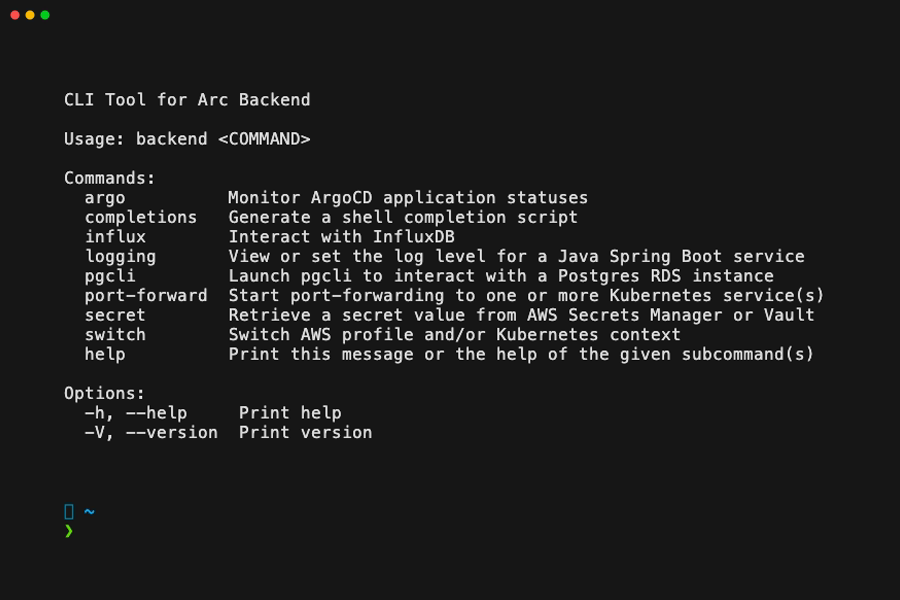
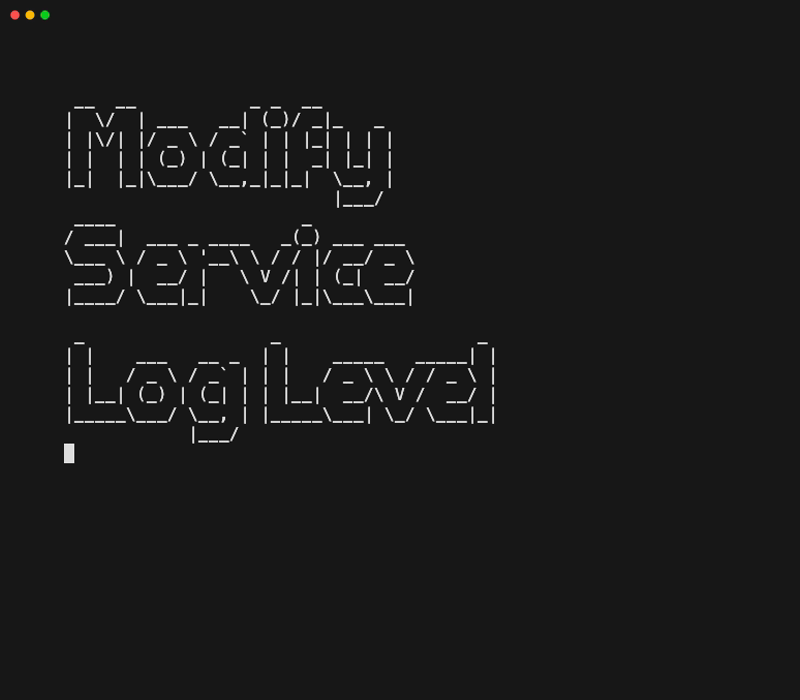
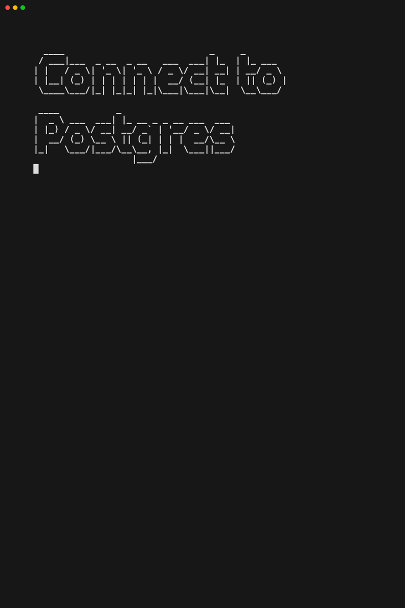
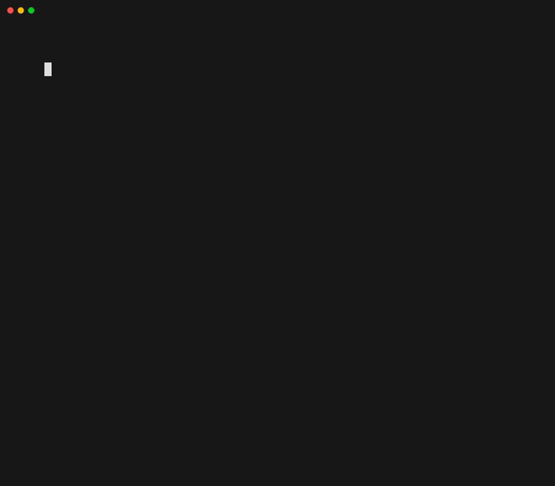

# arcli-backend
This CLI tool unifies functionality from multiple tools (kubectl, awscli, pgcli, vault, etc.) into a single interface tailored for Arc Backend developers. It also replaces functionality that would typically be provided by shell functions/scripts.



## Prerequisites
- [pgcli](https://www.pgcli.com/) (if utilizing the `pgcli` command)
   ```bash
   brew install pgcli
   ```

## Installation

### Option 1: Automated Installer (Recommended)

The easiest way to install arcli-backend is using the automated installer script:

```bash
curl -sSL https://raw.githubusercontent.com/bobchevalieragility/arcli-backend/main/install.sh | bash
```

Or with wget:

```bash
wget -qO- https://raw.githubusercontent.com/bobchevalieragility/arcli-backend/main/install.sh | bash
```

The installer will:
- Automatically detect your OS and architecture
- Download and install latest release binary (to `~/.local/bin/backend` by default)
- Download and install wrapper script and config (to `~/.arcli-backend/` by default)

After installer completes do the following:
1. Add this to your shell profile (~/.bashrc, ~/.zshrc, etc.)
```bash
source ~/.arcli-backend/backend.sh
```
2. Make sure `~/.local/bin` is in your PATH. If it's not, add this to your shell profile (~/.bashrc, ~/.zshrc, etc.)
```bash
export PATH="$PATH:$HOME/.local/bin"
```

#### Customizing the Installation

You can customize the INSTALL_DIR or CONFIG_DIR:

```bash
INSTALL_DIR=/usr/local/bin curl -sSL https://raw.githubusercontent.com/bobchevalieragility/arcli-backend/main/install.sh | bash
```

### Option 2: From Source

1. Install Rust (see https://www.rust-lang.org/tools/install for alternate methods)
   ```bash
   curl --proto '=https' --tlsv1.2 https://sh.rustup.rs -sSf | sh
   ```

2. Download the source code:
   ```bash
   git clone git@github.com:bobchevalieragility/arcli-backend.git
   cd arcli-backend
   ```

3. Build and install the binary:
   ```bash
   ./scripts/install-and-sign.sh
   ```

## Examples
### Dynamically modify logging level of an Arc Backend service
In addition to the desired logging level, the `log-level` command also needs to be told which service to modify, in which K8 cluster the service resides, and a port-forwarding session to the service must exist.  If any of this context does not exist in the current "state" of the program, the corresponding commands to gather that context will be automatically executed before the `log-level` command. Once the overall program execution completes, the port-forwarding session is automatically torn down.



### Launch pgcli
Launching `pgcli` depends on knowing which AWS account to use and which instance of Postres to connect to. If any of that info is not explicitly provided, the corresponding commands to gather that context will be automatically executed, resulting in the user being prompted to provide the necessary context.



### Switch active AWS Profile and/or K8s Context
The available AWS Profiles are inferred by inspecting ~/.aws/config.  Similarly, the available K8 Contexts are inferred by inspecting ~/.kube/config.



## Contributing

### Commit Message Convention

This project uses [Conventional Commits](https://www.conventionalcommits.org/) to automatically generate changelogs and determine version bumps. When you commit changes, use the following format:

```
<type>(<scope>): <description>

[optional body]

[optional footer]
```

#### Commit Types and Changelog Groups

The following table shows which commit prefixes appear in the changelog and how they affect versioning:

| Commit Prefix | Changelog Group        | Semantic Version Impact   | Example Commit Message                    |
|---------------|------------------------|---------------------------|-------------------------------------------|
| `feat`        | ⛰️ Features            | **Minor** (0.1.0 → 0.2.0) | `feat: add vault secret retrieval`        |
| `fix`         | 🐛 Bug Fixes           | **Patch** (0.1.0 → 0.1.1) | `fix: resolve port forwarding timeout`    |
| `perf`        | ⚡ Performance          | **Patch** (0.1.0 → 0.1.1) | `perf: optimize kube API calls`           |
| `refactor`    | 🚜 Refactor            | No version bump           | `refactor: simplify task execution logic` |
| `doc`         | 📚 Documentation       | No version bump           | `doc: update installation instructions`   |
| `style`       | 🎨 Styling             | No version bump           | `style: format code with rustfmt`         |
| `test`        | 🧪 Testing             | No version bump           | `test: add integration tests for RDS`     |
| `chore`       | ⚙️ Miscellaneous Tasks | No version bump           | `chore: update dependencies`              |
| `ci`          | ⚙️ Miscellaneous Tasks | No version bump           | `ci: fix release workflow`                |
| `revert`      | ◀️ Revert              | No version bump           | `revert: undo previous commit`            |

#### Breaking Changes

To trigger a **Major** version bump (0.1.0 → 1.0.0), add `BREAKING CHANGE:` in the commit body or footer:

```
feat: redesign CLI arguments

BREAKING CHANGE: All command arguments have been restructured
```

Or use an exclamation mark after the type/scope:

```
feat!: redesign CLI arguments
```

#### Commits Excluded from Changelog

The following commit types are automatically excluded from the changelog:

- `chore(release):` - Release commits
- `chore(deps)` - Dependency updates  
- `chore(pr)` / `chore(pull)` - PR maintenance
- `refactor(clippy)` - Clippy suggestions

#### Scopes (Optional)

You can add a scope to provide additional context:

```
feat(vault): add secret caching
fix(kube): handle connection timeout
docs(readme): add contribution guidelines
```

### Release Process

This project uses [release-plz](https://release-plz.iem.at/) to automate releases:

1. **Merge a PR to `main`** - Use conventional commit messages
2. **Automated PR is created** - release-plz analyzes commits and creates a PR with:
   - Updated version in `Cargo.toml`
   - Generated changelog in `CHANGELOG.md`
3. **Review and merge the PR** - Once merged:
   - A Git tag is created with the new version
   - A GitHub Release is created and associated with the new tag
   - Binaries are built for multiple architectures and uploaded to Release

No manual version bumping or changelog editing required!

### Methodology
Internally, this tool utilizes task-chaining via a dependency framework to reduce code duplication and to improve maintainability of the code.  See this [doc](https://docs.google.com/document/d/1Fvr7gMZMCNtKUkFURddsq_b4t-vNMayiyHlxMq75i_E/edit?usp=sharing) for a detailed explanation.
